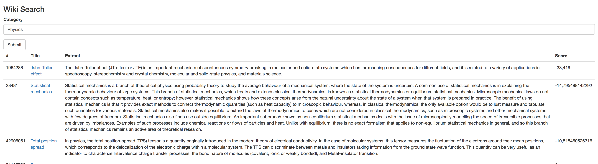

# WikiSearch

This search tool allows you to find articles in a given category. The restults are sorted by introduction text readability, from lowest to highest. The Flesch-Kincaid readability formula is used to give a score for each article.

## Run the project in localhost

To start the project in localhost, we can use PHP built-in server : 

`php -S localhost:PORT`

## References
  - https://en.wikipedia.org/wiki/Flesch%E2%80%93Kincaid_readability_tests
  - https://sourceforge.net/projects/fleschkincaid
  - https://fatfreeframework.com/3.6/home
